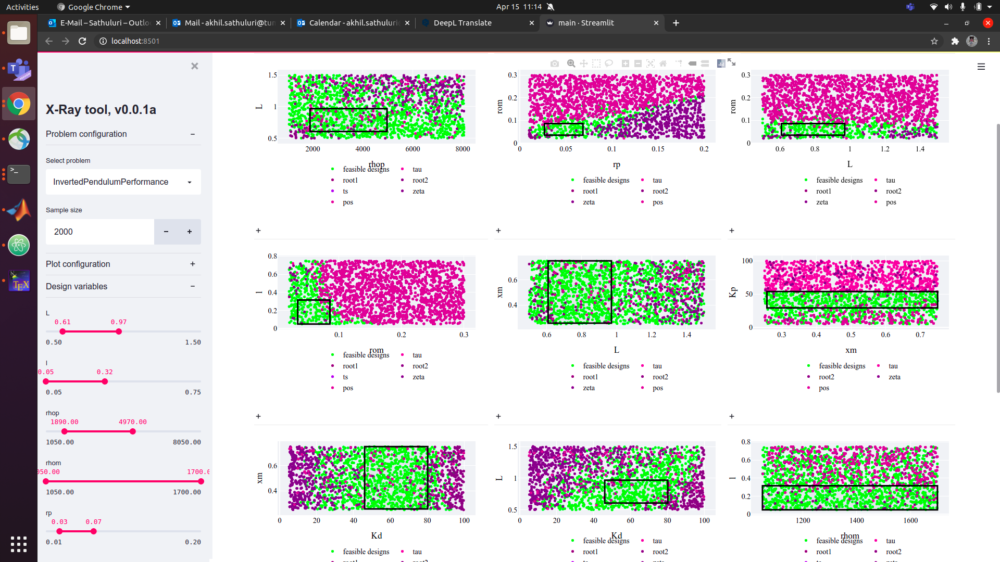

# X-Ray toolbox

## Downloading and setting up the python x-ray toolox

* Click on the download button on the right top in the repository page and download a .zip file of the tool or download the latest release or clone the repo
* Then download and install Anaconda individual edition as given here: <https://www.anaconda.com/products/individual>
* One the installation is done, open installed Ananconda prompt
* Change directory in the prompt to go to the xray tool directory: `cd <path of the xray tool>`
* Then install required libraries by typing: `pip install -r requirements.txt`
<!-- * Or for minimal installation time use `pip install streamlit, plotly, graphviz,` -->
<!-- * Wait for it to install and your tool is ready to go! -->

## Setting up your problem in the tool

* To setup a new problem go to: `xray-main/src/problems`
* All problems follow similar template as the `Line` problem given as an example, so you can copy paste its directory to get started
* Name your problem as the name of the folder (DO NOT USE SPACES IN THE NAME)
* Go into the folder and setup your design variable and quantities of interest bounds in the input folder in their respective .csv files and do not use mathematical expressions, please define numbers
* Use simple variable names, preferably a single letter, also give a description for the variable for clarity
* Similarly, setup bounds on your quantities of interest
* All quantities of interest and design variables should have an upper and lower bound (if you have one variable or discrete set of bounds please see issues to track progress on that feature)
* All bottom-up mappings are defined in the `library` directory
* Change the main file (\`Line.py\`) file to the same name as your directory
* Also change the class name to your directory name
* You can use your favorite editor to setup your bottom-up mappings (Like Atom: <https://atom.io/)>
* You can define problem description and problem name
* Also setup the plotter array to plot variables required (starting from first variable as 0), for example if you want plots for variables 1 and 2 add \[0, 1\] in the array plotter.

## Running the your problem in the X-Ray toolbox

* Once you setup your problem, load it by typing `streamlit run main.py` in the Anaconda prompt being in the `xray/src` directory
* You can find help by clicking the `+ Getting started` button in the center
* Click on your problem in the dropdown in `Problem Configuration`
* Define functions for each quantity of interest defined, make sure the name of the function is same as the name of the variable defined in qoi csv

## General help
* For general help look at the `Help` dropdown within the tool by clicking the `+` on the top of the screen
* You can also raise an issue directly in GitHub/GitLab or mail me at akhil.sathuluri@tum.de

## What is an X-Ray Tool?
For resources have a look at the paper, [Computing solution spaces for robust design](https://github.com/PhD-TUM/xray-python/files/7787066/file.pdf)

# Release history
This is a new stable release of the v0.0.3a. There are several new features included in this version as listed below. X-Ray tool now uses streamlit-1.3.0. The last stable release done on 29-12-2021
### Release v0.0.3a:
## New in v0.0.3a:\n
1. Modularised code for ease of understanding and usage
2. The most awaited "Update" button for the DV and QoI sliders
3. Add images like ADGs or system diagrams by dragging and dropping them into the tool
4. 3D potting of solution spaces
5. Introducing probing `Nominal` design by collapsing the design space, the nominal of the sliders
6. Sample design from the design space (for custom visualisation or processing)
7. All the features from the previous versions are carried on
8. Two examples: Line and Crash Design are included as templates for setting up problems.
Users are encouraged to use the template Line from the current version to set up new problems.
9. A black square now highlights the nominal design
10. Progress update tracker of joblib in terminal using tqdm

<!-- ### Release v0.0.2a:
1. Integrated graphviz for ADG generation
2. Generate matrix plots (All DVs vs all DVs)
3. Scatter3d for 3D visualisation between DVs
4. Added an example in "Help" dropdown

### Release v0.0.1a:
1. Loading a given design variable and quantities of interest space
2. Modifying their intervals using sidebar sliders
3. Save obtained solution space plots as pdf
4. Export the solution spaces as csv
5. Load the problem using the problem problem class
6. Plotly interface to activate and deactivate plot elements -->

<!--  -->
Sample image:

